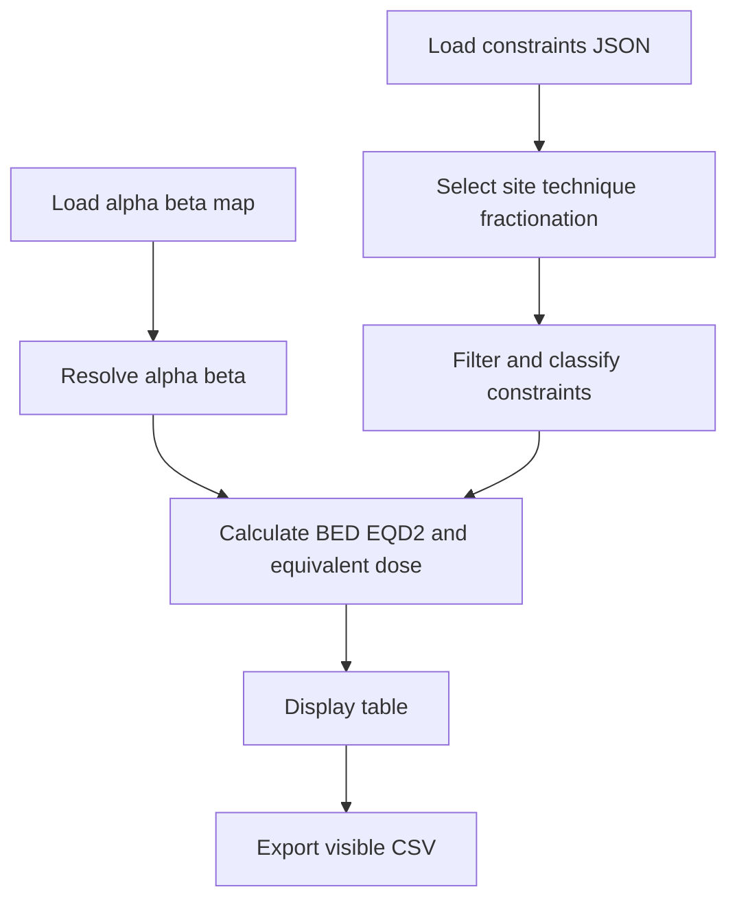

# OAR Constraints Browser and BED EQD2 Calculator

Desktop Python application for browsing a JSON database of organ-at-risk (OAR) constraints, filtering constraints by treatment site, technique, and fractionation, calculating standard linear-quadratic BED and EQD2 values, and exporting the currently visible table to CSV.

> [!CAUTION]
> This repository is a reference and research utility. It is not a treatment-planning system, a clinical decision-support system, or a certified medical device. The supplied limits are guidance-level summaries. Verify every constraint, endpoint definition, dose-volume convention, fractionation, alpha/beta value, and literature source against the original publication, current protocol, and institutional SOP before clinical use.

## Table of contents

- [Overview](#overview)
- [Repository files](#repository-files)
- [Requirements](#requirements)
- [Quick start](#quick-start)
- [Using the application](#using-the-application)
- [What the supplied database contains](#what-the-supplied-database-contains)
- [BED and EQD2 calculations](#bed-and-eqd2-calculations)
- [How row conversion works](#how-row-conversion-works)
- [JSON data formats](#json-data-formats)
- [Filtering and selection logic](#filtering-and-selection-logic)
- [CSV export](#csv-export)
- [Implementation flow](#implementation-flow)
- [Important assumptions and known limitations](#important-assumptions-and-known-limitations)
- [Validation and testing](#validation-and-testing)
- [Troubleshooting](#troubleshooting)
- [Clinical safety and governance](#clinical-safety-and-governance)
- [Suggested improvements](#suggested-improvements)
- [References](#references)
- [License](#license)

## Overview

`oar_constraints_gui.py` is a standard-library Tkinter application. It separates the graphical interface from two editable JSON resources:

- `constraints.json` contains treatment sites, techniques, fractionations, OAR constraints, notes, and source labels.
- `alpha_beta_defaults.json` contains default alpha/beta values and organ-name aliases.

The GUI can:

- Browse constraints by treatment site.
- Filter available fractionations by technique.
- Filter table rows using free text.
- Display `HARD` and `SOFT` priority labels.
- Calculate BED and EQD2 for an independently entered total dose and fraction count.
- Convert a numeric dose constraint from its stored basis fractionation to EQD2.
- Calculate an equivalent total physical dose over the selected number of fractions.
- Resolve alpha/beta from the constraint, an organ map, or a default.
- Reload edited JSON data without restarting the program.
- Open an alternative constraints database for the current session.
- Export the currently visible rows to a UTF-8 CSV file.

The GUI does **not**:

- Import a patient plan, DICOM RT objects, a DVH, or a dose grid.
- Compare patient-specific results against the constraints.
- Produce pass/fail results or warnings for a treatment plan.
- Enforce the meaning of `HARD` or `SOFT`; these are display labels only.
- Validate that a source citation or clinical limit is current.
- Convert volume metrics such as `V20`, `V30`, or `V12Gy` to another fractionation.
- Model treatment time, repopulation, incomplete repair, re-irradiation, EUD, TCP, or NTCP.
- Implement LQ-L, the universal survival curve, or another high-dose model.

## Repository files

| File | Purpose |
|---|---|
| `oar_constraints_gui.py` | Tkinter GUI, JSON loaders, filtering, BED/EQD2 functions, equivalent-dose solver, and CSV export. |
| `constraints.json` | Supplied OAR constraints database, version 0.4. |
| `alpha_beta_defaults.json` | Alpha/beta defaults and 68 organ-name aliases. |
| `BED.docx` | Background notes on BED, EQD2, standard LQ, time correction, LQ-L, USC, incomplete repair, and NTCP/EUD approaches. Only the standard LQ equations are implemented in the Python code. |
| `README_OAR_CONSTRAINTS_GUI.md` | This GitHub usage and technical guide. It may be renamed to `README.md` if this is the repository's main application. |

## Requirements

- Python 3.9 or newer is recommended.
- Tk/Tkinter with themed widgets (`ttk`).
- A graphical desktop session.
- No third-party Python package is required.

Test Tkinter before running the application:

```bash
python -m tkinter
```

or:

```bash
python3 -m tkinter
```

If a small Tk demonstration window opens, Tkinter is available.

On Debian or Ubuntu, Tkinter may need to be installed separately:

```bash
sudo apt install python3-tk
```

The program is not designed for a headless server unless a suitable graphical display or virtual display is provided.

## Quick start

Keep `oar_constraints_gui.py`, `constraints.json`, and `alpha_beta_defaults.json` in the same directory. Open a terminal in that directory and run:

```bash
python3 oar_constraints_gui.py
```

On Windows, the equivalent command is:

```bat
py oar_constraints_gui.py
```

### Working-directory requirement

The two JSON paths are relative to the **current working directory**, not automatically to the directory containing the Python script. The simplest supported layout is:

| Same directory | Required name |
|---|---|
| Python application | `oar_constraints_gui.py` |
| Constraints database | `constraints.json`, unless `DEFAULT_JSON` is changed |
| Alpha/beta map | `alpha_beta_defaults.json` |

Open a terminal in that directory before starting the program.

A more robust future implementation can resolve both JSON paths relative to `__file__`:

```python
BASE_DIR = os.path.dirname(os.path.abspath(__file__))
DEFAULT_JSON = os.path.join(BASE_DIR, "constraints.json")
AB_MAP_JSON = os.path.join(BASE_DIR, "alpha_beta_defaults.json")
```

## Using the application

### Main workflow

1. Select a **Site**.
2. Select a **Technique**.
3. Select an available **Fractionation**.
4. Review the rows that remain after technique and fractionation filtering.
5. Enter a text filter if required.
6. Keep **Show EQD2 + Equivalent Dose** enabled to display radiobiological conversions for eligible dose constraints.
7. Review the resolved alpha/beta source shown in the table.
8. Use the BED/EQD2 calculator for independent schedule calculations.
9. Export the visible rows if a CSV snapshot is needed.

### Interface controls

| Control | Behavior |
|---|---|
| **Site** | Selects a top-level site in the constraints database. Site names are sorted alphabetically by the application. |
| **Technique** | Selects one of the database techniques. Matching is exact and case-sensitive. |
| **Fractionation** | Shows fractionation IDs within the selected site that allow the selected technique. |
| **Reload constraints JSON** | Reloads the currently active constraints file from disk. Useful after editing the JSON externally. |
| **Open constraints JSON** | Opens another `.json` constraints database for the current session. It does not change the Python source or the next-launch default. |
| **Filter** | Performs a case-insensitive substring search over organ, metric, limit, units, volume, notes, and source. |
| **Only constraints matching selected fractionation** | Applies `fractionation_ids` when that field is present. Constraints without `fractionation_ids` are treated as matching every fractionation in the site. |
| **Show EQD2 + Equivalent Dose** | Calculates and displays radiobiological columns for numeric dose constraints. When disabled, the columns remain but their cell values are blank. |
| **Reload alpha/beta map** | Reloads `alpha_beta_defaults.json` from its fixed path. There is no file-picker for a different map. |
| **BED/EQD2 calculator** | Calculates BED and EQD2 from total dose, number of fractions, and alpha/beta. |
| **GUI default alpha/beta** | Intended as the last fallback for unmapped organs. See the known fallback-precedence issue below. |
| **Export visible rows** | Writes only the rows currently displayed in the table. |

### Table columns

| Column | Meaning |
|---|---|
| `Organ` | Organ or structure label from the JSON. |
| `Metric` | Constraint metric such as `Dmax`, `Dmean`, `V20`, or a custom label. |
| `Limit` | Stored numeric or text limit. |
| `Units` | Display unit from the JSON. Units are not normalized or converted. |
| `Volume` | Additional volume definition, such as `0.03cc`, `1-10cc`, or `95%`. |
| `Priority` | Informational `HARD` or `SOFT` label. No logic is attached to it. |
| `alpha/beta used` | Numeric alpha/beta and, when a complete row conversion is available, its source label. |
| `EQD2 (Gy2)` | EQD2 calculated for an eligible stored dose limit under its basis fractionation. |
| `Eqv Dose @ selected (Gy)` | Total physical dose over the selected number of fractions that produces the same EQD2 under the standard LQ model. |
| `Endpoint/Notes` | Free-text definition, endpoint, interpretation, or caution. |
| `Source` | Free-text source label. The GUI does not open or verify the citation. |

The source labels shown for alpha/beta are:

| Label | Resolution path |
|---|---|
| `constraint` | Explicit `alpha_beta` on the constraint row. |
| `map` | Exact normalized organ-name match in `alpha_beta_defaults.json`. |
| `map*` | First partial alias contained in the normalized organ name. |
| `map_default` | `default_alpha_beta` from the alpha/beta map. |
| `gui` | Value entered in the GUI fallback field. In the current code this is normally unreachable because the map default is initialized to 3.0 and checked first. |

## What the supplied database contains

The supplied `constraints.json` reports database version `0.4` and supports these technique labels:

- `3DCRT`
- `IMRT`
- `VMAT`
- `SRS`
- `SBRT`

### Coverage summary

| Site | Base constraints | Fractionations | Fractionation-specific constraints | Total shown in database |
|---|---:|---:|---:|---:|
| CNS Conventional | 7 | 1 | 0 | 7 |
| Head and Neck Conventional | 5 | 1 | 0 | 5 |
| Thorax Conventional | 5 | 1 | 0 | 5 |
| Abdomen Conventional | 5 | 1 | 0 | 5 |
| Pelvis Prostate Conventional | 10 | 1 | 0 | 10 |
| Intracranial SRS 1 fraction | 4 | 1 | 0 | 4 |
| SBRT 3 and 5 fractions Emami 2013 tables | 0 | 2 | 14 | 14 |
| **Total** | **36** | **8** | **14** | **50** |

Across all 50 constraints:

- 35 are marked as dose constraints.
- 15 are marked as volume constraints.
- 25 have `HARD` priority.
- 25 have `SOFT` priority.
- All supplied limits are numeric strings that can be parsed as floating-point numbers.

The database metadata explicitly describes the entries as guidance-level summaries and notes that:

- Dmax definitions can differ between a point dose and a small-volume dose.
- The selected SBRT constraints are described as mostly unvalidated starting points.
- Original organ papers, protocols, and institutional SOPs must take precedence.

### Supplied alpha/beta map

`alpha_beta_defaults.json` contains 68 aliases with a default alpha/beta of 3 Gy. The aliases are rule-of-thumb values, not patient-specific measurements.

Representative defaults include:

| Tissue or endpoint group | Typical mapped alpha/beta |
|---|---:|
| Spinal cord, brainstem, optic pathway, brachial plexus, brain | 2 Gy |
| Liver and kidneys | 2.5 Gy |
| Cochlea, salivary glands, larynx, lung, heart, late esophagus, bowel, rectum, bladder | 3 Gy |
| Oral mucosa, acute esophagus, skin | 10 Gy |

Endpoint specificity matters. For example, the map contains both acute and late esophageal aliases with different values. Prefer an explicit `alpha_beta` in each clinically important constraint rather than relying on partial string matching.

## BED and EQD2 calculations

The application implements the standard linear-quadratic model described in `BED.docx`.

For total dose \(D\) delivered in \(n\) equal fractions:

$$
d = \frac{D}{n}
$$

$$
BED = nd\left(1 + \frac{d}{\alpha/\beta}\right)
    = D\left(1 + \frac{D/n}{\alpha/\beta}\right)
$$

The equivalent dose in 2 Gy fractions is:

$$
EQD2 = \frac{BED}{1 + \frac{2}{\alpha/\beta}}
$$

### Calculator examples

| Total dose | Fractions | Dose per fraction | alpha/beta | BED | EQD2 |
|---:|---:|---:|---:|---:|---:|
| 60 Gy | 30 | 2 Gy | 3 Gy | 100 Gy | 60 Gy2 |
| 60 Gy | 30 | 2 Gy | 10 Gy | 72 Gy | 60 Gy2 |
| 54 Gy | 30 | 1.8 Gy | 2 Gy | 102.6 Gy | 51.3 Gy2 |
| 30 Gy | 5 | 6 Gy | 3 Gy | 90 Gy | 54 Gy2 |

The `Gy2` or `Gy₂` label denotes dose equivalent in 2 Gy fractions. BED is often annotated with the alpha/beta used because BED values calculated with different alpha/beta ratios are not directly interchangeable.

### Equivalent total dose for a selected number of fractions

For a stored EQD2 value \(E\), selected fraction count \(n_s\), and alpha/beta \(a\), the application solves for a total physical dose \(D_s\) such that:

$$
E = \frac{D_s\left(1 + \frac{D_s/n_s}{a}\right)}{1 + \frac{2}{a}}
$$

The code solves the positive root of the resulting quadratic equation and reports `D_s` in the `Eqv Dose @ selected` column.

This value is:

- A total physical dose over the selected number of fractions.
- Not a dose per fraction.
- Not automatically the nominal `n_fractions * dose_per_fraction_Gy` stored in the fractionation object.
- A model-derived equivalent, not a validated replacement constraint.

## How row conversion works

A table row is converted only when all of the following are true:

1. **Show EQD2 + Equivalent Dose** is enabled.
2. The constraint is classified as `dose`.
3. `limit` can be converted to a floating-point number.
4. A positive alpha/beta can be resolved.
5. A positive basis fraction count is present or can be inferred.

### Constraint type

The application first accepts an explicit:

```json
"limit_type": "dose"
```

or:

```json
"limit_type": "volume"
```

If `limit_type` is absent, it infers:

- Metrics beginning with `D` as dose metrics.
- Metrics beginning with `V` as volume metrics.
- Everything else as `other`.

Custom dose metrics that do not begin with `D` must explicitly declare `"limit_type": "dose"`. This is why the supplied `Critical_volume_dose_max` entries can be converted.

### Alpha beta precedence

The implemented order is:

1. Positive `constraint.alpha_beta`.
2. Exact normalized organ-name match in the map.
3. First partial map key contained in the normalized organ name.
4. `default_alpha_beta` from the map.
5. The GUI fallback field.

Normalization lowercases the string, trims it, and collapses repeated whitespace. It does not remove punctuation, standardize laterality, apply TG-263 names, or perform fuzzy matching.

Partial matching is insertion-order dependent and does not choose the longest or most specific alias. Generic keys can therefore win before a later, more specific key. Explicit per-constraint alpha/beta values are the safest option.

### Basis fractionation

A dose constraint can include:

```json
"basis_fractionation": {
  "n": 30,
  "d": 2.0
}
```

The current implementation behaves as follows:

- If `n` is present, EQD2 is calculated from the stored limit and that `n`.
- If `n` is absent but `d` is positive, `n` is inferred as `limit / d`.
- If `d` is absent but `n` is positive, `d` is calculated internally as `limit / n`.
- If both `n` and `d` are present, the stored `d` is not checked against `limit / n` and does not enter the calculation.
- If no positive `n` can be obtained, the table reports `(need basis n)`.

The database should therefore be validated for internal consistency before release.

### Selected fractionation

The equivalent total dose calculation uses only:

```json
"n_fractions": 5
```

The selected fractionation's `dose_per_fraction_Gy` is not used by the equivalent-dose solver. It is descriptive metadata in the current implementation.

### Volume constraints

Volume constraints such as `V20 < 30%`, `V15 < 120 cc`, or `V12Gy < 10 cc` are displayed without BED/EQD2 conversion. Their three radiobiology cells show an em dash.

This is intentional. A scalar BED conversion cannot preserve the meaning of a volume constraint without transforming or otherwise modeling the relevant dose-volume distribution and confirming the endpoint definition.

## JSON data formats

### Constraints database top level

```json
{
  "meta": {},
  "techniques": ["3DCRT", "IMRT", "VMAT", "SRS", "SBRT"],
  "sites": {
    "Site name": {
      "constraints": [],
      "fractionations": []
    }
  }
}
```

The loader does not apply a formal JSON Schema. Missing keys usually become empty lists or empty cells, while malformed JSON produces a load error dialog.

### Constraint object

```json
{
  "organ": "Spinal cord",
  "metric": "Dmax",
  "limit": "50",
  "units": "Gy",
  "volume": "",
  "priority": "HARD",
  "limit_type": "dose",
  "alpha_beta": 2.0,
  "basis_fractionation": {
    "n": 30,
    "d": 2.0
  },
  "notes": "Myelopathy endpoint and local definition.",
  "source": "Full source citation or stable identifier",
  "techniques": ["3DCRT", "IMRT", "VMAT"],
  "fractionation_ids": ["CFRT_1p8-2Gyfx"]
}
```

| Field | Required for display? | Used by calculations? | Notes |
|---|---:|---:|---|
| `organ` | Recommended | Yes | Used for display, filtering, and alpha/beta lookup. |
| `metric` | Recommended | Yes | Used for display and fallback type inference. |
| `limit` | Recommended | Yes | Must be numeric for BED/EQD2 conversion. |
| `units` | Recommended | No | Display only; a dose conversion implicitly assumes Gy. |
| `volume` | Optional | No | Display only; document exact point/small-volume definition here. |
| `priority` | Optional | No | Display only; no pass/fail or sorting logic. |
| `limit_type` | Strongly recommended | Yes | Use `dose` or `volume`; avoids fragile metric-prefix inference. |
| `alpha_beta` | Strongly recommended for dose constraints | Yes | Positive number in Gy. Overrides every fallback. |
| `basis_fractionation` | Required for row conversion | Yes | Positive `n` is the decisive field in the current code. |
| `notes` | Strongly recommended | No | Include endpoint, definition, population, and caution. |
| `source` | Strongly recommended | No | Free text only; include DOI, PMID, report, table, or protocol version. |
| `techniques` | Optional | Yes | Exact technique allowlist. Empty or absent means all techniques. |
| `fractionation_ids` | Optional | Yes | Exact fractionation-ID allowlist. Empty or absent means all site fractionations. |

### Fractionation object

```json
{
  "id": "SBRT_5fx",
  "label": "SBRT 5 fractions",
  "n_fractions": 5,
  "dose_per_fraction_Gy": null,
  "techniques": ["SBRT"],
  "constraints": []
}
```

| Field | Purpose |
|---|---|
| `id` | Value displayed and matched by `fractionation_ids`. Must be unique within the site. |
| `label` | Human-readable description shown in the status line. |
| `n_fractions` | Used to calculate equivalent total dose. Must be positive. |
| `dose_per_fraction_Gy` | Descriptive in the current code; not used by the solver. |
| `techniques` | Exact technique allowlist controlling whether the fractionation appears. |
| `constraints` | Constraints appended only when this fractionation is selected. |

Site-level constraints and selected fractionation-specific constraints are concatenated. The program does not deduplicate identical rows.

### Alpha beta map

```json
{
  "meta": {
    "version": "1.0",
    "notes": []
  },
  "default_alpha_beta": 3.0,
  "organs": {
    "spinal cord": 2.0,
    "lung": 3.0,
    "oral mucosa": 10.0
  }
}
```

Map values must be convertible to floating-point numbers. A load failure shows a warning and leaves the application with an internal 3.0 Gy default.

## Filtering and selection logic

The displayed table is assembled in this order:

1. Find the selected site.
2. Find the selected fractionation whose technique allowlist accepts the selected technique.
3. Copy the site's base constraints.
4. Append constraints nested in the selected fractionation.
5. Exclude rows whose `techniques` list does not contain the selected technique.
6. If fractionation matching is enabled, apply `fractionation_ids` when present.
7. Apply the case-insensitive free-text filter.
8. Calculate radiobiology columns for eligible rows.
9. Insert the row into the table.

Important details:

- Technique and fractionation-ID matching are exact and case-sensitive.
- A missing or empty `techniques` list means all techniques.
- A missing or empty `fractionation_ids` list means all selected fractionations.
- The free-text filter does not search priority, technique, alpha/beta, EQD2, equivalent dose, or fractionation ID.
- Selecting a technique can remove every fractionation for a site; in that case the fractionation selection becomes blank.
- The status line reports site, technique, fractionation ID/label, and number of visible rows.

## CSV export

**Export visible rows** writes the displayed table using Python's standard `csv` module:

- Encoding: UTF-8.
- First row: the 11 table-column names.
- Remaining rows: only currently visible rows, after all selection and filtering.
- Calculated values: exported as the formatted strings shown in the GUI.
- Hidden database rows: not exported.

The CSV does not include:

- Database name or version.
- Database filename or checksum.
- Selected site, technique, or fractionation as separate metadata.
- Export timestamp.
- Calculator input values.
- Software version or commit hash.
- Complete bibliographic records beyond each row's `Source` text.

Record this context separately for reproducible clinical QA or research use. If Microsoft Excel displays the alpha/beta symbol, subscript characters, or em dashes incorrectly, import the file explicitly as UTF-8 rather than relying on locale-based automatic detection.

## Implementation flow



The application has three computational helpers that can be imported without launching the GUI:

```python
from oar_constraints_gui import bed, eqd2, total_dose_for_eqd2
```

| Function | Purpose |
|---|---|
| `bed(D, n, alpha_beta)` | Standard LQ BED for equal fractions. |
| `eqd2(D, n, alpha_beta)` | Converts the same schedule to EQD2. |
| `total_dose_for_eqd2(E, n, alpha_beta)` | Solves for the positive total-dose root producing EQD2 `E` in `n` fractions. |

Invalid `n <= 0` or `alpha_beta <= 0` returns `NaN` from the mathematical helpers. GUI entries that cannot be parsed, or have invalid `n`/alpha-beta, clear the calculator output to em dashes. A negative total dose is not explicitly rejected.

## Important assumptions and known limitations

| Priority | Behavior or limitation | Consequence | Recommended mitigation |
|---|---|---|---|
| High | Relative JSON paths are resolved from the current working directory. | Launching from another folder can make valid files appear missing. | Start in the project directory or resolve paths relative to `__file__`. |
| High | The program is a reference browser, not a plan evaluator. | It cannot determine whether a patient's DVH or plan satisfies a constraint. | Verify the actual plan in the TPS or a validated analysis system. |
| High | The database contains summarized guidance and selected historical constraints. | Limits, endpoints, and definitions may not match a current protocol. | Verify the original publication, protocol version, and institutional SOP. |
| High | Standard LQ is applied to SRS/SBRT dose constraints. | Biological equivalence is model-dependent and uncertain at large dose per fraction. | Treat SRS/SBRT conversions as exploratory; prioritize validated fractionation-specific constraints. |
| High | Volume metrics are not converted. | `Vx` constraints remain tied to their original physical-dose and fractionation definition. | Use validated schedule-specific DVH constraints or a separately validated DVH transformation method. |
| High | Units are display text and are not validated. | A numeric dose marked in cGy or another unit would be treated as Gy by the equations. | Enforce a JSON schema and allow only supported units. |
| High | `Dmax`, small-volume dose, and critical-volume definitions are not standardized by the code. | Superficially similar rows can represent different endpoints. | Store explicit volume definitions and match the source protocol/TPS statistic. |
| Medium | The GUI alpha/beta fallback is normally unreachable. | Editing the GUI fallback usually has no effect because the map default 3.0 is checked first. | Move the GUI fallback before the map default, or remove the redundant control. |
| Medium | Partial organ matching uses the first contained alias, not the longest match. | A generic alias can override a later endpoint-specific alias. | Use explicit constraint-level alpha/beta or implement deterministic longest-match/structured identifiers. |
| Medium | `basis_fractionation.d` is ignored when `n` exists and is not checked for consistency. | Incorrect JSON metadata can go unnoticed. | Validate `limit / n` against the documented basis and define the intended convention. |
| Medium | Selected `dose_per_fraction_Gy` is not used by the equivalent-dose solver. | The output may not equal the nominal course dose implied by the selected fractionation object. | Label it clearly as an isoeffective total dose over `n` fractions. |
| Medium | No formal JSON Schema is enforced. | Misspelled fields can silently produce empty cells or skipped behavior. | Add schema validation with actionable error messages. |
| Medium | `HARD` and `SOFT` are not enforced. | Priority labels can be mistaken for software decisions. | State local governance semantics and implement logic only after validation. |
| Medium | CSV exports omit selection and provenance metadata. | A CSV can be misinterpreted after separation from the application. | Add database version, source hash, selected context, timestamp, and software version. |
| Medium | Source entries are free text. | Citations cannot be automatically verified or opened. | Store DOI, PMID, report/table, protocol version, and access date in structured fields. |
| Low | The free-text filter omits priority and calculated fields. | Searches such as `HARD` or an EQD2 value return no match. | Extend the searchable text or document the scope. |
| Low | The alpha/beta file has no open-file dialog. | Alternative maps require replacing the fixed file or changing code. | Add a map picker and show its path/version. |
| Low | No row deduplication is performed. | The same constraint can appear twice if present at site and fractionation levels. | Add stable IDs and deduplicate during table assembly. |
| Low | UTF-8 CSV has no BOM. | Some locale configurations may display Unicode characters incorrectly in Excel. | Import as UTF-8 or offer `utf-8-sig`. |

### Model scope

Only equal-fraction standard LQ is implemented. The background document discusses additional concepts that the software does not implement:

- Overall treatment-time and repopulation correction.
- LQ-L for high dose per fraction.
- Universal Survival Curve.
- Incomplete-repair/Lea-Catcheside modeling.
- EUD/NTCP-based equivalent dose.

The program also does not account for:

- Interrupted or unequal fraction schedules.
- Multiple fractions per day and interfraction interval.
- Prior radiotherapy or cumulative BED/EQD2.
- Recovery between treatment courses.
- Spatially heterogeneous dose or deformable dose accumulation.
- Patient-specific radiosensitivity, comorbidity, systemic therapy, or organ function.
- Dose-rate or RBE effects.
- Statistical uncertainty in alpha/beta or source constraints.

## Validation and testing

### Static checks

Run these before a release:

```bash
python3 -m py_compile oar_constraints_gui.py
python3 -m json.tool constraints.json > /dev/null
python3 -m json.tool alpha_beta_defaults.json > /dev/null
```

On Windows, omit the redirection or use an appropriate destination.

### Mathematical smoke test

Create a temporary interactive session or test file:

```python
from math import isclose
from oar_constraints_gui import bed, eqd2, total_dose_for_eqd2

assert isclose(bed(60, 30, 3), 100.0)
assert isclose(eqd2(60, 30, 3), 60.0)
assert isclose(bed(60, 30, 10), 72.0)
assert isclose(eqd2(30, 5, 3), 54.0)

e = eqd2(30, 5, 3)
assert isclose(total_dose_for_eqd2(e, 5, 3), 30.0)
```

### Minimum database validation set

1. A dose constraint with explicit alpha/beta and complete basis fractionation.
2. A dose constraint using an exact map alias.
3. A dose constraint using partial matching.
4. An unmapped organ using the default.
5. A volume constraint that must remain unconverted.
6. A custom dose metric that requires explicit `limit_type`.
7. Technique-specific constraints.
8. Fractionation-specific constraints.
9. A deliberately inconsistent `limit`, `n`, and `d` combination.
10. Duplicate IDs, source rows, and sanitized citations.
11. Unicode organ names and CSV round-trip.
12. Invalid JSON and missing files.

### Clinical validation checklist

- Verify each numeric limit against the original source.
- Record the endpoint, grade, follow-up duration, patient population, and treatment context.
- Confirm whether `Dmax` means a point, voxel, percentile, or small-volume statistic.
- Confirm whether organ definitions include or exclude target volumes.
- Confirm the original fractionation and how `basis_fractionation.n` should be interpreted for each metric.
- Confirm alpha/beta by tissue **and endpoint**, not only by organ name.
- Compare the software calculation with an independent spreadsheet or script.
- Test conventional and high-dose schedules separately.
- Validate every protocol-specific database revision before release.
- Use version control and peer review for JSON changes.
- Never infer plan compliance from this browser alone.

## Troubleshooting

### Missing constraints JSON on startup

Confirm that `constraints.json` is in the terminal's current working directory and that the filename uses the same capitalization as `DEFAULT_JSON`.

### Tkinter is unavailable

Run:

```bash
python3 -m tkinter
```

Install the operating-system Tk package if the import or test window fails.

### No fractionation appears

The selected site's fractionations do not allow the selected technique. Check exact capitalization and the fractionation's `techniques` array.

### Expected constraints are missing

Check:

- The selected site.
- The selected technique.
- The selected fractionation ID.
- `techniques` on the constraint.
- `fractionation_ids` on the constraint.
- The free-text filter.
- Whether the constraint is nested under another fractionation.

### A volume constraint has no EQD2

This is expected. The application converts only dose-type constraints with numeric limits and a basis fraction count.

### A dose constraint shows “need basis n”

Add a positive `basis_fractionation.n`, or add a positive `basis_fractionation.d` from which `n = limit / d` can be inferred. Verify the clinical validity of that basis before conversion.

### Changing the GUI alpha beta fallback has no effect

The current resolver checks the map's default value before the GUI field, and the internal map default is initialized to 3.0. Use an explicit constraint value, edit the map, or change the resolver precedence.

### An organ receives the wrong alpha beta

Add an explicit `alpha_beta` to the constraint. Partial matching is simple containment in JSON insertion order and can select a generic alias before a more specific one.

### CSV characters display incorrectly in Excel

Import the CSV using UTF-8 encoding. A future exporter can use `encoding="utf-8-sig"` for easier Windows Excel detection.

### The application cannot open on a server

Tkinter requires a graphical display. Run it in a desktop session or create a separate command-line/web interface for server use.

## Clinical safety and governance

The database should be governed like a clinical reference dataset even when used only for research or plan-review support.

- Assign a named clinical owner and technical maintainer.
- Give each release a version, date, change log, and approval record.
- Store complete references, not only shorthand source labels.
- Require dual review for constraint, endpoint, alpha/beta, and fractionation changes.
- Keep protocol-specific constraints separate from general literature summaries.
- Do not silently replace a prior database version.
- Preserve the exact JSON used for each exported CSV or analysis.
- Mark superseded, controversial, or unvalidated entries explicitly.
- Validate new high-dose constraints against current SBRT/SRS guidance rather than extrapolating conventional limits.
- Document whether a row is a planning objective, recommended limit, protocol deviation threshold, or absolute exclusion criterion.

Although the supplied application does not intentionally process patient data, users can add identifying text to custom JSON notes or CSV filenames. Follow institutional policy when storing or sharing modified databases and exports.

## Suggested improvements

High-value development priorities are:

1. Resolve resource paths relative to the script so the application can be launched from any working directory.
2. Add a formal JSON Schema and startup validation report.
3. Fix alpha/beta fallback precedence and replace first-match alias logic with stable identifiers or longest-match rules.
4. Add explicit software and database versions to the GUI and CSV export.
5. Store structured references with DOI, PMID, report/table, protocol name, version, and access date.
6. Add stable IDs for sites, fractionations, constraints, tissues, and endpoints.
7. Validate units and reject unsupported dose units.
8. Check internal consistency between limit, `n`, and `d`.
9. Distinguish planning objectives from tolerance limits and protocol deviation thresholds.
10. Add automated tests for formulas, inverse solutions, filtering, aliases, malformed data, and CSV export.
11. Add a read-only details panel showing complete provenance and calculation steps for the selected row.
12. Export selection context, database checksum, timestamp, and calculation inputs.
13. Add an optional command-line mode for batch and headless workflows.
14. Integrate with a validated DVH evaluator only as a separate, thoroughly tested module.
15. For high-dose work, support schedule-specific constraints and document whether any alternative radiobiological model is validated for the intended endpoint.

## References

### Included project material

- [`BED.docx`](BED.docx) — supplied radiobiology background and caveats.
- [`constraints.json`](constraints.json) — supplied constraints data and source labels.
- [`alpha_beta_defaults.json`](alpha_beta_defaults.json) — supplied default alpha/beta map.

### Radiobiology and clinical guidance

- Fowler JF. [The linear-quadratic formula and progress in fractionated radiotherapy](https://pubmed.ncbi.nlm.nih.gov/2670032/). *British Journal of Radiology*. 1989.
- Fowler JF. [21 years of biologically effective dose](https://pubmed.ncbi.nlm.nih.gov/20603408/). *British Journal of Radiology*. 2010.
- Bentzen SM, et al. [Quantitative Analyses of Normal Tissue Effects in the Clinic: an introduction to the scientific issues](https://pubmed.ncbi.nlm.nih.gov/20171515/). *International Journal of Radiation Oncology Biology Physics*. 2010.
- Benedict SH, et al. [Stereotactic body radiation therapy: the report of AAPM Task Group 101](https://pubmed.ncbi.nlm.nih.gov/20879569/). *Medical Physics*. 2010. See also the [AAPM report page](https://www.aapm.org/pubs/reports/detail.asp?docid=102).
- Grimm J, et al. [High Dose per Fraction, Hypofractionated Treatment Effects in the Clinic: An Overview](https://pubmed.ncbi.nlm.nih.gov/33864823/). *International Journal of Radiation Oncology Biology Physics*. 2021.

These references provide background and validation context. Their inclusion does not mean that every value in the supplied JSON has been independently verified against the cited primary table or current protocol.

